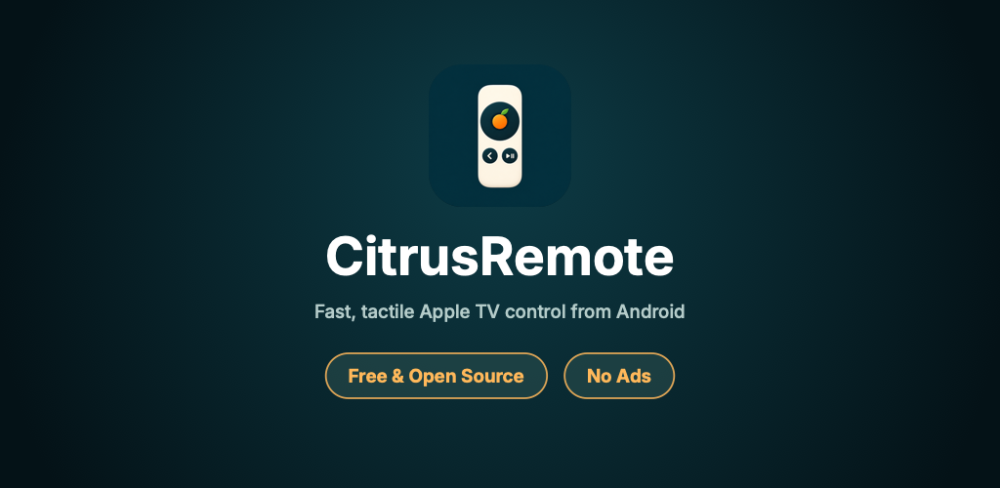
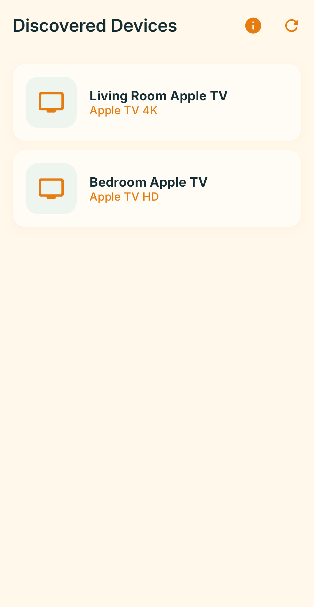
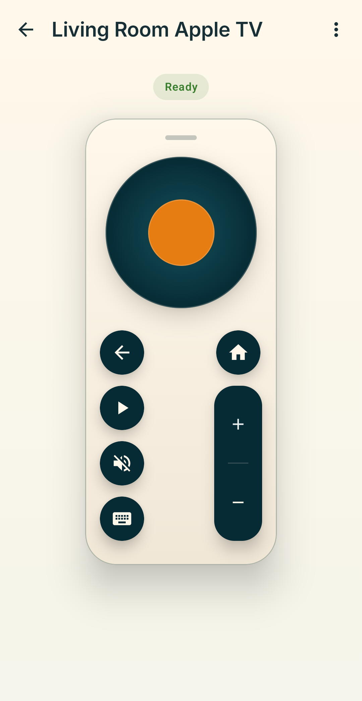
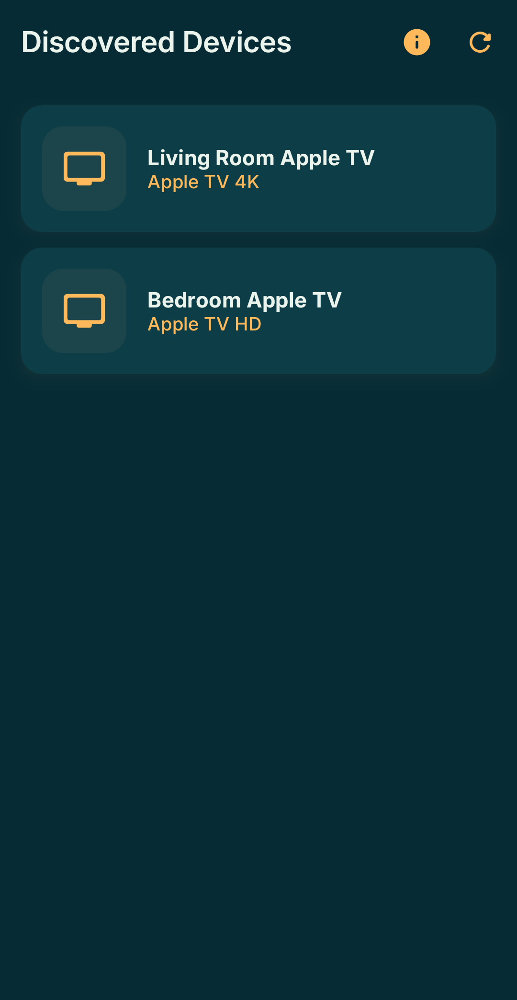
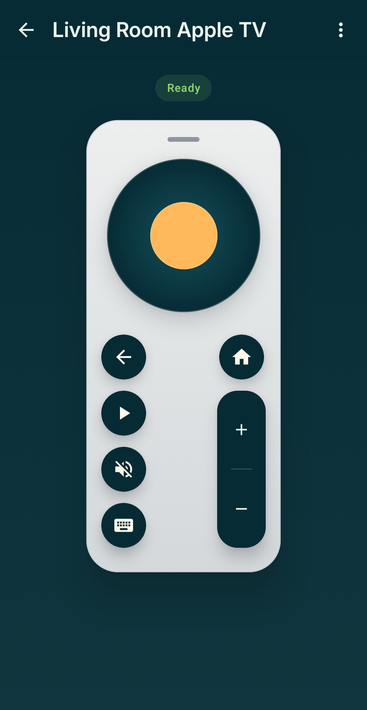

# CitrusRemote

<p align="center">
  
</p>

<p align="center">
  <strong>Fast, private Android remote control for Apple TV.</strong><br />
  No ads • No tracking • Free & Open Source
</p>

---

CitrusRemote is an Android remote application designed for Apple TV. It communicates directly over your local Wi-Fi network using tvOS's native Companion protocol, providing immediate button response, media playback controls, and native phone keyboard typing.

## Screenshots

| Device Discovery (Light) | Remote Controls (Light) | Device Discovery (Dark) | Remote Controls (Dark) |
| :---: | :---: | :---: | :---: |
|  |  |  |  |

## Features

- **Quick Local Discovery**: Discovers Apple TV devices automatically over ZeroConf / Bonjour on your local Wi-Fi.
- **Tactile Media Controls**: Ergonomic D-pad navigation, volume control, mute, play/pause, and tvOS home/back navigation.
- **Direct Keyboard Input**: Type logins, search queries, and passwords into tvOS text fields using your Android device's native keyboard.
- **Dark Mode Native**: Thoughtfully styled for low-light living room environments and OLED screens.
- **Privacy by Design**:
  - Zero analytics, telemetry, or advertising SDKs.
  - No user accounts or external servers required.
  - Pairing credentials stay on your device and are excluded from cloud backups.

## Requirements

- **Android**: Android 7.0 (API level 24) or higher.
- **Apple TV**: Apple TV HD (4th generation) or Apple TV 4K running tvOS.
- **Network**: Android phone and Apple TV must be connected to the same local Wi-Fi or Ethernet network.

## Architecture & Tech Stack

- **UI**: 100% Kotlin Jetpack Compose and Material 3.
- **Architecture**: MVVM with unidirectional data flow and Kotlin Coroutines / StateFlow.
- **Dependency Injection**: Hilt.
- **tvOS Protocol**: [pyatv](https://github.com/postlund/pyatv) executed via [Chaquopy](https://chaquo.com/chaquopy/) (embedded Python 3.12 runtime).

## Development & Building

### Build from Source

CitrusRemote builds with standard Gradle:

```bash
# Debug build
./gradlew assembleDebug

# Run unit tests
./gradlew testDebugUnitTest
```

### Testing with the Mock Apple TV Server

To test pairing and navigation without a physical Apple TV:

1. **Start the Mock Server**:
   ```bash
   source .venv/bin/activate
   python mock_appletv.py
   ```
   *The script will output running status and dynamically assigned mock ports.*

2. **Connect via the Android Emulator**:
   - Run the debug build on the Android Emulator.
   - Navigate to the **Discovered Devices** screen.
   - Tap the **Wrench/Build icon** in the top right corner to inject a "Mock Apple TV (Dev)" device.
   - Tap **Mock Apple TV (Dev)** to connect via the emulator's `10.0.2.2` bridge.
   - When prompted for the PIN, enter `1111`.
